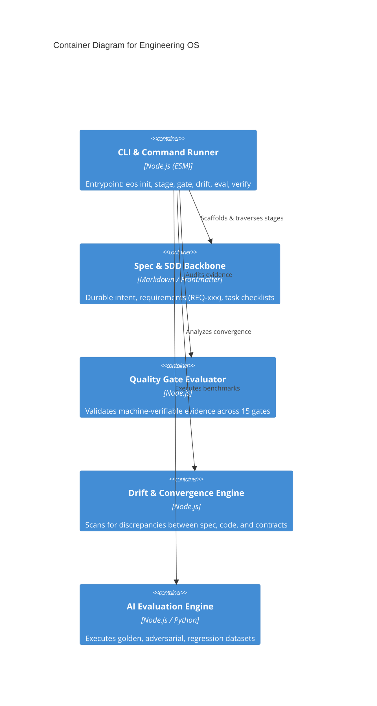

# C4 Architecture: Container Diagram

```mermaid
C4Container
    title Container Diagram for Engineering OS

    Container(cli, "CLI & Command Runner", "Node.js (ESM)", "Entrypoint: eos init, stage, gate, drift, eval, verify")
    Container(spec_engine, "Spec & SDD Backbone", "Markdown / Frontmatter", "Durable intent, requirements (REQ-xxx), task checklists")
    Container(gate_auditor, "Quality Gate Evaluator", "Node.js", "Validates machine-verifiable evidence across 15 gates")
    Container(drift_detector, "Drift & Convergence Engine", "Node.js", "Scans for discrepancies between spec, code, and contracts")
    Container(eval_harness, "AI Evaluation Engine", "Node.js / Python", "Executes golden, adversarial, regression datasets")

    Rel(cli, spec_engine, "Scaffolds & traverses stages")
    Rel(cli, gate_auditor, "Audits evidence")
    Rel(cli, drift_detector, "Analyzes convergence")
    Rel(cli, eval_harness, "Executes benchmarks")
```
