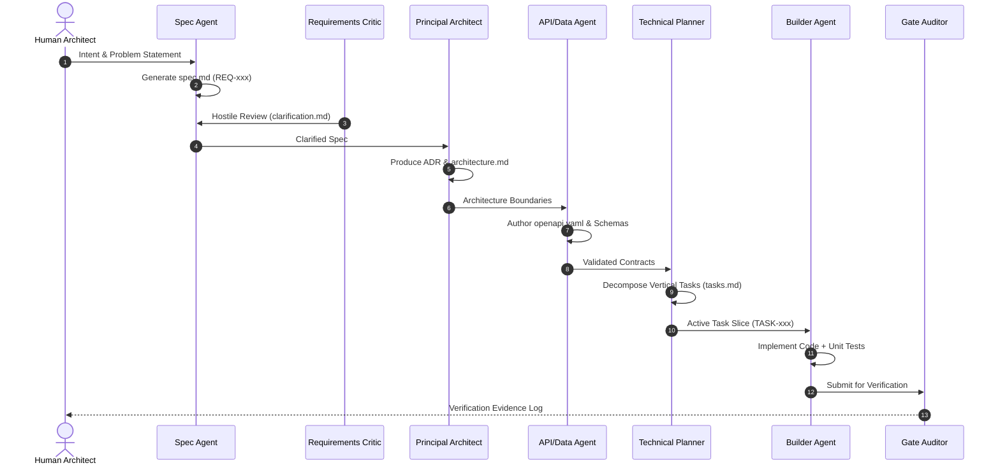

# Data Flow & Traceability Architecture

```mermaid
sequenceDiagram
    autonumber
    actor Human as Human Architect
    participant Spec as Spec Agent
    participant Critic as Requirements Critic
    participant Arch as Principal Architect
    participant API as API/Data Agent
    participant Planner as Technical Planner
    participant Builder as Builder Agent
    participant Gate as Gate Auditor

    Human->>Spec: Intent & Problem Statement
    Spec->>Spec: Generate spec.md (REQ-xxx)
    Critic->>Spec: Hostile Review (clarification.md)
    Spec->>Arch: Clarified Spec
    Arch->>Arch: Produce ADR & architecture.md
    Arch->>API: Architecture Boundaries
    API->>API: Author openapi.yaml & Schemas
    API->>Planner: Validated Contracts
    Planner->>Planner: Decompose Vertical Tasks (tasks.md)
    Planner->>Builder: Active Task Slice (TASK-xxx)
    Builder->>Builder: Implement Code + Unit Tests
    Builder->>Gate: Submit for Verification
    Gate-->>Human: Verification Evidence Log
```
