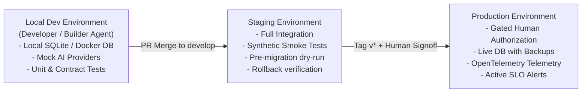

# Deployment Topology & Environments

### Environment Isolation Rules
- **Development**: Isolated mock or local container datastores; zero production credentials.
- **Staging**: Complete mirror of production architecture; automated smoke tests executed via `scripts/smoke-test.sh`.
- **Production**: Strictly protected; accessible only via authorized CI/CD runners with KMS-managed secrets and mandatory human signoff.
