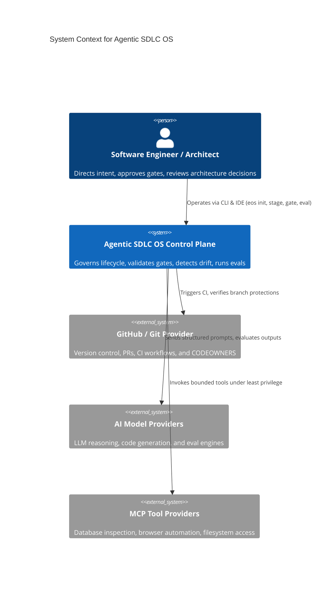

# C4 Architecture: System Context

```mermaid
C4Context
    title System Context for Agentic SDLC OS

    Person(user, "Software Engineer / Architect", "Directs intent, approves gates, reviews architecture decisions")
    System(eos, "Agentic SDLC OS Control Plane", "Governs lifecycle, validates gates, detects drift, runs evals")
    
    System_Ext(github, "GitHub / Git Provider", "Version control, PRs, CI workflows, and CODEOWNERS")
    System_Ext(ai_models, "AI Model Providers", "LLM reasoning, code generation, and eval engines")
    System_Ext(mcp_tools, "MCP Tool Providers", "Database inspection, browser automation, filesystem access")

    Rel(user, eos, "Operates via CLI & IDE (eos init, stage, gate, eval)")
    Rel(eos, github, "Triggers CI, verifies branch protections")
    Rel(eos, ai_models, "Sends structured prompts, evaluates outputs")
    Rel(eos, mcp_tools, "Invokes bounded tools under least privilege")
```
