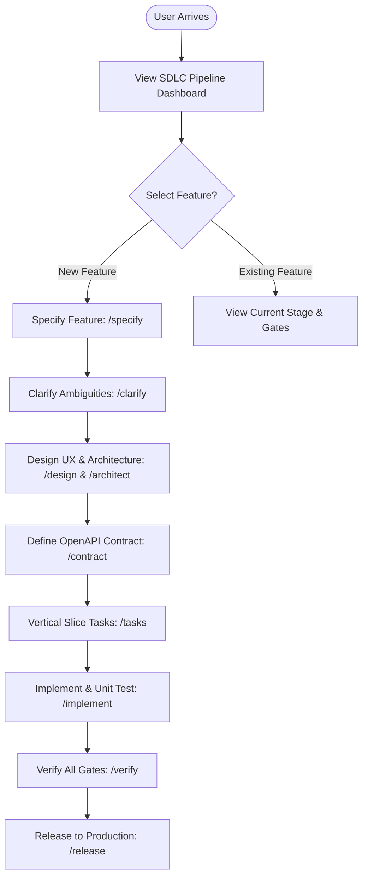

# Core User Flows

```mermaid
flowchart TD
    Start([User Arrives]) --> Dashboard[View SDLC Pipeline Dashboard]
    Dashboard --> SelectFeature{Select Feature?}
    SelectFeature -->|New Feature| CreateSpec[Specify Feature: /specify]
    SelectFeature -->|Existing Feature| ViewStage[View Current Stage & Gates]
    
    CreateSpec --> Clarify[Clarify Ambiguities: /clarify]
    Clarify --> Design[Design UX & Architecture: /design & /architect]
    Design --> Contract[Define OpenAPI Contract: /contract]
    Contract --> TaskBreakdown[Vertical Slice Tasks: /tasks]
    TaskBreakdown --> Implement[Implement & Unit Test: /implement]
    Implement --> Verify[Verify All Gates: /verify]
    Verify --> Release[Release to Production: /release]
```
